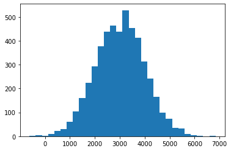
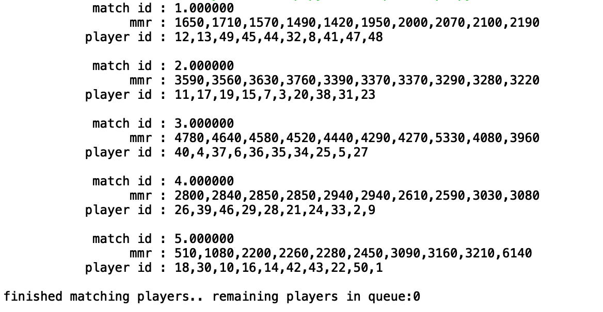

A quick implementation of matchmaking for dota 2.  

Idea is to randomly choose one player and take 9 other players with nearest mmr to form a match.

 Players mmr assumed to be normally distributed, with mean 3k and variance 1k.

 

